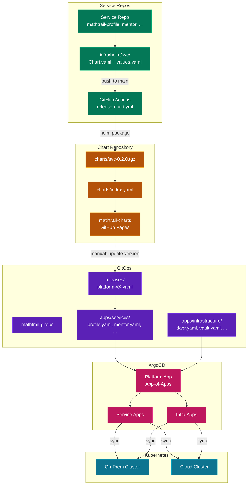
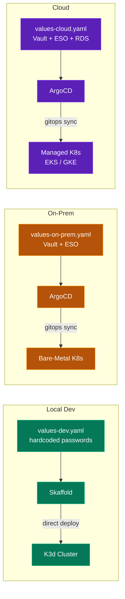
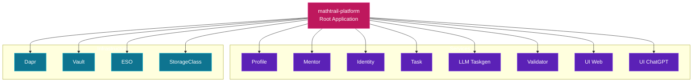

# GitOps & Deployment Flow

## Code to Runtime Pipeline



## Three Deployment Scenarios



## App-of-Apps Pattern



## Release & Promotion Flow

```
Dev (local k3d)  →  On-Prem  →  Cloud
    Skaffold          ArgoCD      ArgoCD
    direct deploy     git sync    git sync
```

**Release manifest** (`mathtrail-gitops/releases/platform-vX.yaml`) pins all service versions:

```yaml
services:
  profile: 0.2.0
  mentor: 1.3.0
  identity: 0.5.0
  task: 0.1.0
```

**Promotion**: `git cherry-pick` release commit between environment branches.

**Rollback**: `git revert` the release commit in `mathtrail-gitops`.

## Progressive Delivery

- **Canary**: Deploy v2 → 10% traffic → metrics evaluation → 50% → 100%
- **Blue-Green**: Deploy parallel environment → manual promotion → instant rollback
- Controlled via `rollout` values in each service's Helm chart
