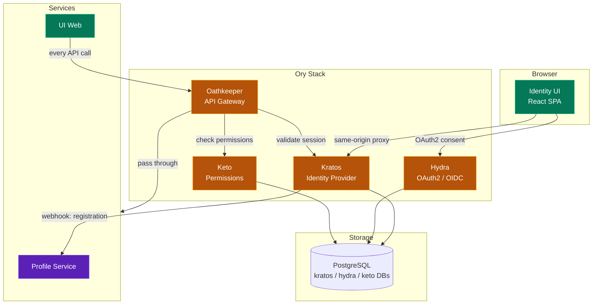
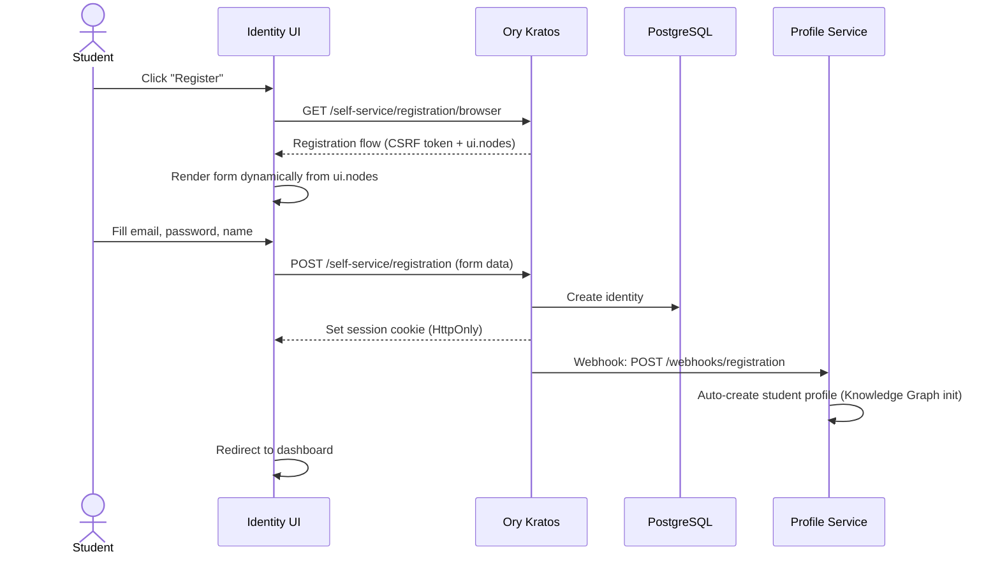
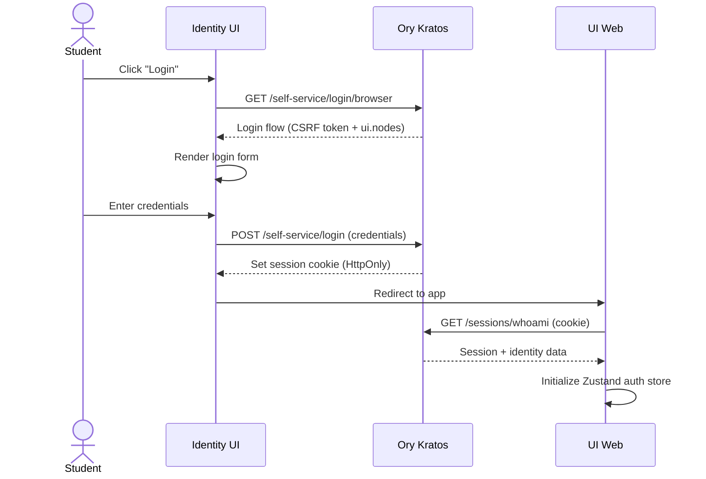
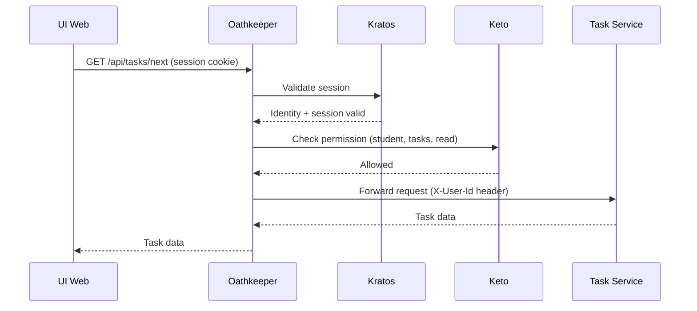

# Identity Flow

## Authentication Architecture

MathTrail uses the Ory stack for identity management. All auth flows are cookie-based (no localStorage tokens).

## Registration Flow

## Login Flow

## API Authorization Flow

## Key Principles

- **Cookie-First**: All auth uses HttpOnly session cookies, never localStorage
- **Same-Origin**: nginx proxy (prod) and Vite proxy (dev) keep SPA + Kratos on same origin
- **Dynamic Forms**: UI forms are built from Kratos `ui.nodes` — never hardcode fields
- **Zero-Trust API**: Every API call goes through Oathkeeper for session validation + Keto for permissions
