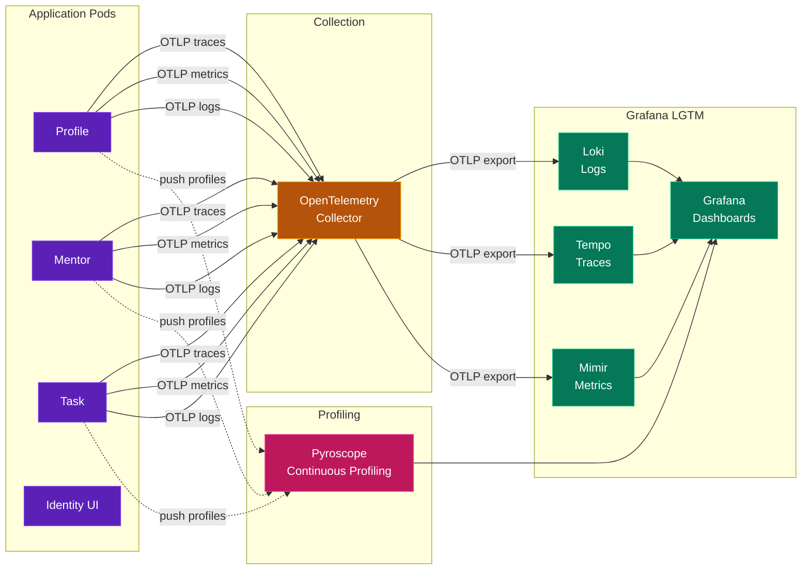
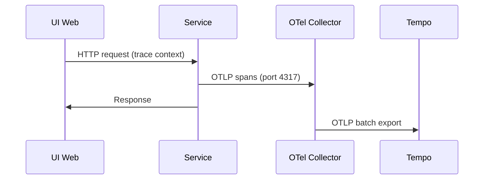

# Observability Stack

## Telemetry Pipeline



## Data Flow Details

### Traces (Distributed Tracing)



### Metrics

| Source | Protocol | Destination |
|--------|----------|-------------|
| Go services (OTel SDK) | OTLP/gRPC | OTel Collector |
| Go services | Prometheus endpoint | OTel Collector (scrape) |
| OTel Collector | OTLP/gRPC | Mimir |

### Logs

| Source | Protocol | Destination |
|--------|----------|-------------|
| All pods | stdout/stderr | OTel Collector (filelog receiver) |
| OTel Collector | OTLP/gRPC | Loki |

### Profiling

| Source | Protocol | Destination |
|--------|----------|-------------|
| Go services | pyroscope-go SDK (push) | Pyroscope |

## OTel Collector Configuration

The collector acts as a **smart gateway** with k8sattributes processor for metadata enrichment:

```
Receivers:
  - zipkin (port 9411)     ← Legacy Zipkin traces
  - otlp (gRPC port 4317)  ← Metrics + Logs + Traces
  - filelog                 ← Container stdout

Processors:
  - k8sattributes          ← Add pod name, namespace, labels
  - batch                  ← Batch for efficiency

Exporters:
  - otlp → Grafana Alloy → Loki/Tempo/Mimir
```

## Application Tracing Configuration

Services export traces via the OTel SDK to the OTel Collector. The Zipkin receiver is
retained for backward compatibility.

## Namespace Layout

| Namespace | Components |
|-----------|-----------|
| `mathtrail` | All application services |
| `monitoring` | OTel Collector, Grafana, Loki, Tempo, Mimir, Pyroscope |
