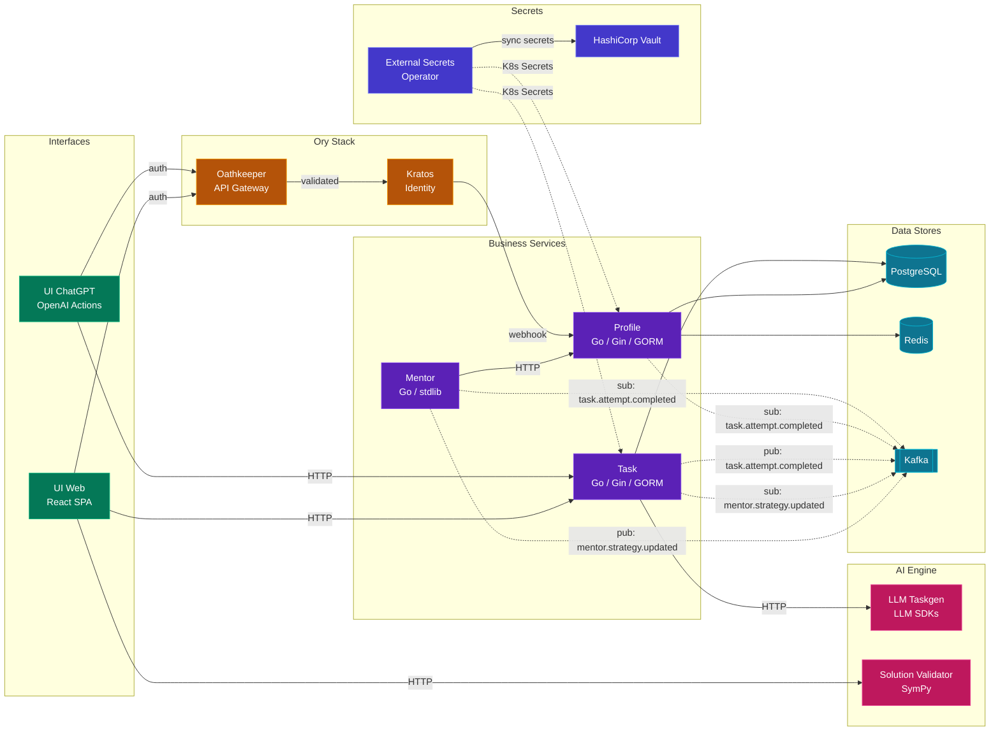
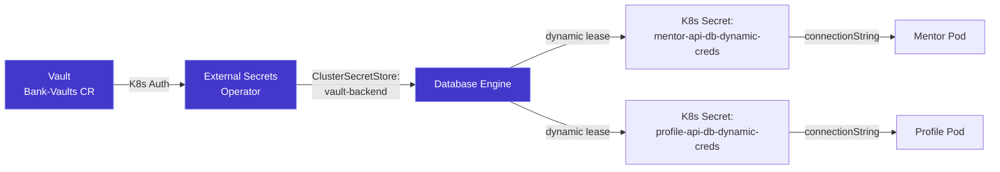
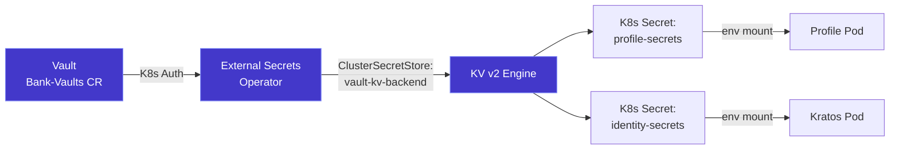

# Microservices Interaction

## Service Communication Map

Services communicate via HTTP invocation and Kafka pub/sub.

## Communication Patterns

### Service Invocation (Synchronous HTTP)

| Caller | Target | Method | Purpose |
|--------|--------|--------|---------|
| Mentor | Profile | `GET /profiles/{id}` | Read student data for strategy |
| Task | LLM Taskgen | `POST /generate` | Generate math problem |
| UI Web | Task | `GET /tasks/next` | Get next task for student |
| UI Web | Validator | `POST /validate` | Submit solution |

### Pub/Sub (Asynchronous via Kafka)

| Publisher | Topic | Subscribers | Purpose |
|-----------|-------|------------|---------|
| Kratos (webhook) | `identity.registration.completed` | Profile | Auto-create student profile |
| Mentor | `mentor.strategy.updated` | Task | Pass generation parameters |
| Task | `task.attempt.completed` | Profile, Mentor | Update skills/XP, re-evaluate strategy |

## Secrets Flow (Bank-Vaults + ESO)

Vault is managed by the **Bank-Vaults Operator** via a declarative Custom Resource (`kind: Vault`).
The operator handles initialization, auto-unseal (keys stored in K8s Secret), and configuration
reconciliation. All Vault settings (auth methods, policies, secrets engines, database roles) are
defined in `infra/manifests/vault-instance.yaml`.

Two types of secrets are delivered to services via ESO:

### Dynamic Database Credentials (Database Secrets Engine)

| Service | Vault Role | Database | TTL | Refresh |
|---------|-----------|----------|-----|---------|
| mentor-api | `mentor-api-role` | mentor | 1h | 55m |
| profile-api | `profile-api-role` | profile | 1h | 55m |
| task-api | `task-api-role` | mathtrail | 1h | 55m |

### Static KV Secrets (KV v2 Engine)

**Vault Path Convention**: `secret/data/{env}/{service}/{key}`

| Service | Keys |
|---------|------|
| mathtrail-profile | `db-password`, `redis-password` |
| mathtrail-task | `db-password` |
| mathtrail-identity | `kratos-dsn`, `hydra-dsn` |
| mathtrail-llm-taskgen | `llm-api-key` |
